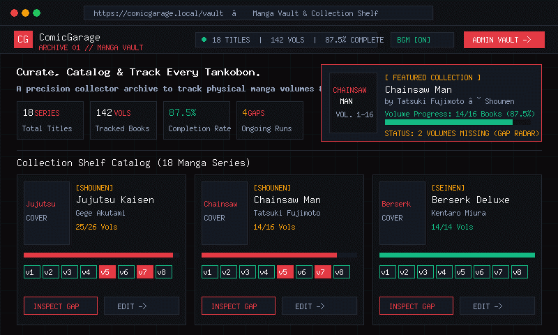

<p align="center">
  
</p>

<h1 align="center">ComicGarage (コミック ガレージ)</h1>

<p align="center">
  <strong>私設コミック書庫 // ARCHIVE 01</strong><br>
  <em>A high-precision Japanese Manga &amp; Graphic Novel Vault with Ambient Lo-Fi Cyber-Deck, Volume Gap Radar, and Filament v3 Collection Intelligence.</em>
</p>

<p align="center">
  <a href="https://laravel.com"></a>
  <a href="https://filamentphp.com"></a>
  <a href="https://php.net"></a>
  <a href="https://livewire.laravel.com"></a>
  <a href="LICENSE"></a>
  
</p>

---

## 📸 Interactive UI Walkthrough &amp; Showcase

<p align="center">
  
</p>

<p align="center">
  <em>⚡ Live UI Demo: Japanese Manga Vault Shelf → Volume Inspector Modal → Ambient Lo-Fi Cyber-Deck → Filament v3 Admin Command Center</em>
</p>

> **Designed for serious manga collectors &amp; tankōbon curators.** Never buy duplicate volumes at bookstores again, track uncollected volume gaps in real-time, monitor acquisition investments, and enjoy reading manga accompanied by 24/7 curated ambient Lo-Fi streams.

---

## 📑 Table of Contents

- [🌟 Core Features](#-core-features)
  - [1. Japanese Tankōbon Vault (Public Catalog)](#1-japanese-tankōbon-vault-public-catalog)
  - [2. In-Page Volume Inspector (Zero-Reload Modal)](#2-in-page-volume-inspector-zero-reload-modal)
  - [3. Ambient Lo-Fi YouTube Audio Deck](#3-ambient-lo-fi-youtube-audio-deck)
  - [4. Filament v3 Admin Command Center](#4-filament-v3-admin-command-center)
  - [5. Financial &amp; Acquisition Ledger](#5-financial--acquisition-ledger)
- [⌨️ Global Keyboard Shortcuts](#️-global-keyboard-shortcuts)
- [🏗️ System Architecture &amp; Database Schema](#️-system-architecture--database-schema)
- [🛠️ Tech Stack](#️-tech-stack)
- [🚀 Installation &amp; Setup Guide](#-installation--setup-guide)
- [📂 Project Directory Structure](#-project-directory-structure)
- [🗺️ Future Roadmap](#️-future-roadmap)
- [📄 License &amp; Author](#-license--author)

---

## 🌟 Core Features

### 1. Japanese Tankōbon Vault (Public Catalog)
- **Aesthetic Cyberpunk-Minimalist UI**: Built on a calibrated dark-mode palette (`#08090d`), subtle blueprint grid overlays, and crimson/amber accents inspired by Japanese manga publishing imprints (*Jump Comics*, *Kodansha*, *Shogakukan*).
- **Live Vault Telemetry**: Real-time header metrics broadcasting total series count, tracked physical volumes, and overall percentage completion rate.
- **Spotlight Showcase Card**: Automatically highlights featured manga collections with dynamic completion progress bars and missing volume notifications.
- **Instant Search Engine**: Real-time client-side search filtering by manga title, mangaka (author), or genre with zero page reload.
- **Multi-Facet Taxonomy Filters**:
  - **Status Tabs**: Filter across *All Titles*, *Missing Gaps* (incomplete ongoing runs), and *Complete Sets*.
  - **Genre Chips**: Fast switching across *Shounen*, *Seinen*, *Horror*, *America*, etc.
- **Micro Volume Matrix**: Each comic card displays individual mini volume chips (`v1`, `v2`, `v3`...) color-coded in emerald green for collected books and crimson for missing gaps.
- **Smart Dust-Jacket Fallbacks**: If a volume lacks uploaded cover imagery, a sleek Japanese typography fallback dust-jacket is generated dynamically.

```
+-------------------------------------------------------------------------+
| [CG] ComicGarage   | 18 TITLES • 142 VOLS • 87.5% COMPLETE | [BGM ON]   |
+-------------------------------------------------------------------------+
| 🔍 Search: chainsaw [KEY /]   [All Titles] [Missing Gaps] [Complete Sets] |
| GENRE: [ALL] [SHOUNEN] [SEINEN] [HORROR] [AMERICA]                      |
|                                                                         |
| +-------------------------+  +-------------------------+                |
| | CHAINSAW MAN            |  | JUJUTSU KAISEN          |                |
| | by Tatsuki Fujimoto     |  | by Gege Akutami         |                |
| | Progress: 14/16 Vols    |  | Progress: 25/26 Vols    |                |
| | [v1][v2][v3][v4][v5!]...|  | [v1][v2][v3]...[v26!]   |                |
| | [INSPECT GAP]  [EDIT →] |  | [INSPECT GAP]  [EDIT →] |                |
| +-------------------------+  +-------------------------+                |
+-------------------------------------------------------------------------+
```

---

### 2. In-Page Volume Inspector (Zero-Reload Modal)
- **Instant Detailed Inspection**: Click on any comic card to launch a high-speed modal inspect view powered by pre-rendered client-side JSON telemetry.
- **Volume Breakdown Grid**: Displays a complete matrix of every single volume (e.g. Volume 1 to Volume 100), with explicit status indicators:
  - 🟢 **COLLECTED** — Physical copy owned in library vault.
  - 🔴 **MISSING GAP** — Uncollected volume requiring bookstore/online acquisition.
- **Direct Vault Linkage**: Seamlessly open the specific comic record in Filament Admin Panel (`/admin/comics/{id}/edit`) to toggle collection checkboxes or adjust volume metadata.
- **Keyboard Dismissable**: Fully accessible with `Esc` key support.

---

### 3. Ambient Lo-Fi YouTube Audio Deck
- **Curated Reading Atmosphere**: Built-in floating audio deck designed for late-night tankōbon reading and vault curation sessions.
- **4 Curated Audio Stations**:
  1. ⚡ **Lofi Live**: *Lofi Girl 24/7 Live Stream* (Beats to relax/study to).
  2. 🌸 **Ghibli Lofi**: *Studio Ghibli Lounge* (Chill acoustic & piano anime beats).
  3. 🌙 **4 A.M Chill**: *4 A.M Manga Reading Session* (Deep nocturnal lo-fi hip hop).
  4. 📻 **User Mix**: *Anime Openings Lofi Mix* (Curated YouTube Radio Feed).
- **Collapsible Cyber-Deck**:
  - **Expanded Deck**: Video screen drawer, visual station selector, seekable progress bar, equalizer animation, and volume slider.
  - **Collapsed Mini Pill**: Floating bottom-right pill with real-time dancing equalizer bars and play/pause toggle.
- **Intelligent Fallback Engine**: If YouTube restricts embed playback due to copyright licensing, the widget detects the state automatically and renders a fallback banner with 1-click station switching or direct YouTube tab launch.
- **Global Keyboard Shortcut**: Press `M` anywhere on the homepage to toggle music on/off instantly.

---

### 4. Filament v3 Admin Command Center
- **Collection Metric Overview (`ComicOverview.php`)**:
  - **Total Judul (Titles)**: Active manga series registered in the database.
  - **Total Volume & Progress**: Number of physical books tracked + collection percentage + **7-month volume growth mini sparkline chart**.
  - **Belanja Bulan Ini**: Current month's comic expenditure with month-over-month comparison trends (↑ / ↓).
  - **Total Investasi**: Accumulated financial investment across all recorded purchases.
  - **Kelengkapan Seri**: Ratio of 100% complete manga series versus series with missing volume gaps.
- **7 Telemetry & Analytics Dashboard Widgets**:
  - 📈 **Growth Chart (`GrowthChart.php`)**: Dual-line chart plotting monthly volume additions against purchase frequency with 3m, 6m, 12m, and yearly filters.
  - 🏆 **Top Comics Chart (`TopComicsChart.php`)**: Ranked bar chart highlighting manga series with the highest volume counts (with Top 5, 10, and 15 limit filters).
  - 📊 **Genre Distribution Chart (`GenreDistributionChart.php`)**: Real-time doughnut chart breaking down collection composition (*Shounen*, *Seinen*, *Horror*, *America*).
  - 🏪 **Store Spending Chart (`StoreSpendingChart.php`)**: Retailer expenditure breakdown (*Gramedia, Tokopedia, Shopee, Kinokuniya, Amazon JP*) with All-Time, This Year, and This Month filters.
  - ⚠️ **Missing Gap Radar Table (`IncompleteComicsWidget.php`)**: Dedicated dashboard table displaying all incomplete manga series alongside their exact missing volume numbers and 1-click edit shortcuts.
  - 🧾 **Latest Purchases Ledger (`LatestPurchasesWidget.php`)**: Real-time recent transaction log with direct purchase history details.
- **1-Click Multi-Volume Batch Generator**:
  - When registering a new manga series (e.g., *One Piece*, *Bleach*), enter the total volume count (1 to 100).
  - ComicGarage automatically generates the complete volume repeater checklist instantly with volume numbers and default collected flags.
- **Excel Data Export**: Powered by `pxlrbt/filament-excel` for 1-click bulk exports of comic inventories and purchasing records.

---

### 5. Financial &amp; Acquisition Ledger
- **Volume Purchase Record (`ComicPurchaseResource.php`)**: Log each book purchase with Title, Volume number, Price in Indonesian Rupiah (`Rp`), Store/Marketplace (*Gramedia, Tokopedia, Shopee, Kinokuniya, Amazon JP*), and Date of Purchase.
- **Monthly Filter &amp; Summarizer**: Instant filter by month and year with real-time automatic expenditure summation.
- **Public Acquisition Feed**: Displays the 6 most recent acquisitions directly on the public vault homepage.

---

## ⌨️ Global Keyboard Shortcuts

| Shortcut | Scope | Action |
| :--- | :--- | :--- |
| <kbd>/</kbd> | Public Homepage | Instantly focuses the Manga Catalog search input and scrolls into view |
| <kbd>M</kbd> | Public Homepage | Toggles the Ambient Lo-Fi YouTube Audio Deck (Play / Pause) |
| <kbd>Esc</kbd> | Public Homepage | Closes the Volume Inspector Modal or resets all active search filters |

---

## 🏗️ System Architecture &amp; Database Schema

```
                      +-------------------+
                      |      authors      |
                      +-------------------+
                      | id (PK)           |
                      | name (VARCHAR)    |
                      | image_path (NULL) |
                      | timestamps        |
                      +---------+---------+
                                | 1
                                |
                                | N
                      +---------v---------+
                      |      comics       |
                      +-------------------+
                      | id (PK)           |
                      | author_id (FK)    |
                      | name (VARCHAR)    |
                      | genre (VARCHAR)   |
                      | image (VARCHAR)   |
                      | timestamps        |
                      +---------+---------+
                                | 1
                                |
                                | N
                      +---------v---------+
                      |    comicvols      |
                      +-------------------+
                      | id (PK)           |
                      | comic_id (FK)     |
                      | volume (INT)      |
                      | volume_name (NULL)|
                      | is_collected (BOL)|
                      | timestamps        |
                      +-------------------+

+-----------------------------------------------------------+
|                     comic_purchases                       |
+-----------------------------------------------------------+
| id (PK)           | title (VARCHAR)   | volume (INT)      |
| price (DECIMAL)   | purchase_date (DT)| store (VARCHAR)   |
| timestamps                                                |
+-----------------------------------------------------------+

+-----------------------------------------------------------+
|                      image_comics                         |
+-----------------------------------------------------------+
| id (PK)           | image_path (VARCHAR)                  |
| timestamps                                                |
+-----------------------------------------------------------+
```

---

## 🛠️ Tech Stack

| Layer | Technology | Description |
| :--- | :--- | :--- |
| **Backend Framework** | [Laravel 12.x](https://laravel.com) | Modern PHP framework with expressive syntax &amp; robust ORM |
| **Admin Panel** | [Filament PHP v3.3](https://filamentphp.com) | TALL-stack administrative interface &amp; telemetry widgets |
| **Frontend Reactive** | [Livewire 3.6](https://livewire.laravel.com) | Dynamic full-stack reactive components for Laravel |
| **Styling &amp; Design** | [Tailwind CSS v4](https://tailwindcss.com) + Vite 6 | High-performance atomic CSS engine &amp; lightning bundler |
| **Language Runtime** | [PHP 8.2+](https://php.net) | Strongly typed PHP runtime |
| **Database** | SQLite / MySQL 8.0+ | Database-agnostic schema with foreign key cascading |
| **Excel Export** | `pxlrbt/filament-excel` | Spreadsheet generator for collection audits |
| **Audio Engine** | YouTube IFrame Player API | Embedded ambient background audio cyber-deck |
| **Typography** | Space Grotesk, Plus Jakarta Sans, JetBrains Mono | Curated editorial &amp; developer typography |

---

## 🚀 Installation &amp; Setup Guide

Follow these step-by-step instructions to run ComicGarage locally on your machine.

### Prerequisites
- **PHP** `>= 8.2` (with `pdo`, `sqlite3` or `mysql`, `gd`, `mbstring`, `curl` extensions enabled)
- **Composer** `>= 2.2`
- **Node.js** `>= 18.x` &amp; **npm**
- **Git**

---

### Step 1: Clone the Repository
```bash
git clone https://github.com/ArloDel/ComicGarage.git
cd ComicGarage
```

### Step 2: Install PHP &amp; Node Dependencies
```bash
composer install
npm install
```

### Step 3: Environment Setup
Copy the example environment file and configure your settings:
```bash
# Windows (PowerShell)
Copy-Item .env.example .env

# Linux / macOS
cp .env.example .env
```

### Step 4: Generate Application Encryption Key
```bash
php artisan key:generate
```

### Step 5: Database Migration &amp; Storage Symlink
Run database migrations and establish the public storage symlink for uploaded comic cover images:
```bash
# Run database migrations
php artisan migrate

# Link public storage directory for uploaded manga artwork
php artisan storage:link
```

### Step 6: Create Filament Admin Account
Create your administrative credentials to access the Filament Vault dashboard:
```bash
php artisan make:filament-user
```
*You will be prompted to enter your Name, Email address, and Password.*

### Step 7: Build Frontend Assets
```bash
# For production build
npm run build

# Or for local hot-reload development
npm run dev
```

### Step 8: Start the Local Development Server
```bash
php artisan serve
```

🎉 Open your browser and navigate to:
- **Public Manga Vault**: `http://127.0.0.1:8000`
- **Filament Admin Panel**: `http://127.0.0.1:8000/admin`

---

## 📂 Project Directory Structure

```text
ComicGarage/
├── app/
│   ├── Filament/
│   │   ├── Resources/
│   │   │   ├── ComicResource.php            # Manga CRUD & Batch Volume generator
│   │   │   ├── ComicPurchaseResource.php    # Acquisition Ledger & Monthly filter
│   │   │   └── ComicResource/Pages/
│   │   └── Widgets/
│   │       ├── ComicOverview.php            # 6 Telemetry metric cards & sparklines
│   │       ├── GrowthChart.php              # Monthly growth line chart
│   │       ├── TopComicsChart.php           # Ranked volume leaderboards
│   │       ├── GenreDistributionChart.php   # Genre doughnut analytics
│   │       ├── StoreSpendingChart.php       # Spending by retailer breakdown
│   │       ├── IncompleteComicsWidget.php   # Missing gap radar table
│   │       └── LatestPurchasesWidget.php    # Recent transaction log
│   ├── Models/
│   │   ├── Author.php                       # Mangaka entity
│   │   ├── Comic.php                        # Manga series entity
│   │   ├── Comicvol.php                     # Physical volume entity
│   │   └── ComicPurchase.php                # Acquisition ledger model
│   └── Providers/
│       └── Filament/AdminPanelProvider.php  # Filament configuration
├── database/
│   └── migrations/                          # Database schema definitions
├── docs/
│   └── assets/
│       ├── comicgarage-preview.svg          # Animated showcase banner
│       └── demo.svg                         # Vector demo graphic
├── generate_demo.php                        # Offline GIF demo generator script
├── public/
│   ├── logo.svg                             # ComicGarage brandmark
│   └── images/                              # Public demo assets
├── resources/
│   └── views/
│       └── welcome.blade.php                # Japanese Manga Vault & Audio Deck
├── routes/
│   └── web.php                              # Public routes & telemetry aggregation
└── composer.json
```

---

## 🗺️ Future Roadmap

- [ ] **ISBN-13 Barcode Scanner**: Camera-assisted barcode scanning component in Filament for instant volume registration.
- [ ] **Marketplace Price Scraper**: Live price comparison across Tokopedia, Shopee, and Amazon Japan.
- [ ] **Release Notification Radar**: Automated scheduled background jobs to alert curators when new manga tankōbon volumes are published.
- [ ] **Wishlist Sharing**: Generate shareable public links and QR codes for collector gift registries.
- [ ] **Spatie Tags Integration**: Multi-dimensional tagging system for sub-genres (*Isekai*, *Cyberpunk*, *Slice of Life*).

---

## 📄 License &amp; Author

This project is open-sourced software licensed under the [MIT License](LICENSE).

Developed with ❤️ by **[ArloDel](https://github.com/ArloDel)**.
<br>
*For inquiries, feedback, or manga recommendations, feel free to open an Issue or Pull Request!*
